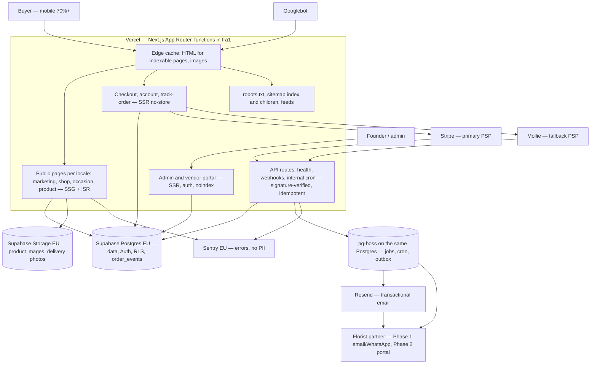

# Architecture

One deployable Next.js app, one Postgres, one object store, one queue. This document is the short,
current version of `plan/01-architecture.md`: the system as it is wired today, the module map with
its owning spec, and the decisions spec 001 deliberately deferred. The plan holds the reasoning,
the ADRs hold the decisions (`docs/adr/`), and this file holds what is true in the repository.

Spec 001 §2 "Documentation and ledger" owns this file; `plan/12` §9 makes it a deliverable of
**"spec 001, then any spec adding a module"**.

## 1. System overview

`plan/01` §1 as a diagram. Everything inside the Vercel box is this repository; everything outside
it is an actor or a processor. Nothing here is deployed twice: previews, staging and production are
the same code with different environment variables.



Rules that follow from the picture and are enforced elsewhere in the repo:

- every indexable page is server-rendered HTML at the edge (`plan/01` §3); personalisation is a
  client island, never a reason to SSR an indexable page;
- no IP-based redirect anywhere (ADR-0006, `fo/no-geo-redirect`); locale is in the URL, currency in
  a cookie;
- third-party SDKs live in one adapter per module; order status changes only through
  `orderService.transition` (ADR-0009, `fo/no-direct-order-status-write`);
- all environment access goes through `src/lib/env.ts`; all logging through `src/lib/logger.ts`.

## 2. Repository layout

The same tree `pnpm check-layout` enforces (`scripts/check-layout.ts`, spec 001 AC-3). The manifest
in that script is the machine-readable copy of this list; `tests/unit/architecture-doc.test.ts`
fails if the two disagree.

```
src/app/                  routes only, thin: a pass-through root layout plus one document per
                          leaf — (chooser)/ owns `/`, [locale]/ owns every localised URL,
                          not-found.tsx owns the 404 (see below) — plus api/
src/modules/<module>/     one directory per module below, public barrel in index.ts
src/lib/                  env (zod), logger, health, sentry, cache adapter; db client from spec 002
src/jobs/                 pg-boss job definitions and cron schedule
src/emails/               React Email templates, localised
src/config/               locales.ts, locales.data.ts, currencies.ts, address-formats.ts,
                          cookies.ts, countries.ts, site-links.ts, occasions.ts, categories.ts,
                          company.ts, payment-methods.ts
                          (spec 003/004; zod-validated at module load, no database — `pnpm
                          check:no-db`. `locales.data.ts` is the authored locale rows as plain
                          constants and imports nothing, so the 500 document can read a locale
                          without pulling zod into every page's client chunk — TASK-046;
                          `cookies.ts` is the cookie register, and
                          `docs/compliance/cookie-register.md` derives its table from it via
                          `pnpm cookies:check` — TASK-050; countries.ts, site-links.ts,
                          categories.ts, company.ts are the Phase 0 data registries of spec 004
                          §2/§5.1 — TASK-047: the seven destinations with `toCountryRow()`, the
                          header/footer link registry behind `isPublished()`, the category row,
                          and the company identity behind `registered: false`;
                          payment-methods.ts is the colophon's method list, every row
                          `available: false` until 013/014 configures a processor, which is how
                          spec 004 §8's third-party-trademark rule is enforced as data —
                          TASK-049);
                          occasions.ts is the homepage occasion registry of spec 004 §13's
                          resolution note — TASK-053: the six tiles with their per-locale slugs
                          behind `published: false` (spec 008 publishes the occasion pages) and
                          the destination's dated occasions with the order-by cutoffs the
                          "Coming up in Poland" strip prints, each cutoff an authored instant and
                          none of them computed; payment-methods-by-country.ts and
                          feature-flags.ts follow in 002/004
src/config/catalogue/     the authored catalogue dataset (spec 005 §2, §13 Q9, ADR-0017 —
                          TASK-061): catalogue/schemas.ts (the closed facet enums of
                          `plan/10` §1.1), catalogue/projections.ts (`toProductRow()` and the
                          eight other projections onto spec 002 §5.1's row shapes, each pinned
                          by a unit test), catalogue/products.data.ts (the 84 SKUs of
                          `plan/10` §2.1), catalogue/tiers.data.ts, catalogue/categories.data.ts,
                          catalogue/occasions.data.ts, catalogue/addons.data.ts. Zod-parsed at
                          module load, no database (`pnpm check:no-db`), server-only — nothing
                          under it is reachable from a client entry point. It is the *single*
                          authored source of catalogue rows: spec 002's seed and spec 006's
                          `seed/data/*.json` are generated projections of it, never a second
                          hand-authored copy. catalogue/prices.data.ts (TASK-062) holds one
                          authored record per destination — currency, the VAT rate on flowers and
                          the standard rate its add-ons carry, the `plan/10` §2.3 bands with
                          their authored tier ladders, the dated Sunday and peak-day surcharge
                          amounts and the six add-on prices — expanded into `country_price` and
                          `addon_country_price` rows in integer minor units, VAT and delivery
                          included, with `active_from`/`active_to` so a price is superseded and
                          never updated; catalogue/fx.data.ts holds one dated ECB euro-reference
                          snapshot with integer `ratePpm`, `FX_BUFFER_BP` and
                          `MAX_FX_AGE_HOURS`. `pnpm catalogue:check` is the gate over the whole
                          dataset and runs as its own CI job
tests/unit/               Vitest, node env
tests/integration/        Vitest against DATABASE_URL (live from spec 002)
tests/contract/           adapter-against-recorded-fixture tests (from Phase 1)
tests/e2e/                Playwright, chromium mobile + desktop
tests/visual/             Playwright screenshots, 0.1% threshold
tests/fixtures/           shared fixtures: occasion dates, currencies, addresses, lint, seo, env
tests/a11y/, tests/dev-os/, tests/msw/   axe run, hook checks, request mocks
db/migrations/            versioned SQL, each with a hand-written `NNNN_name.down.sql` beside it
                          (spec 002 §5.1, §13 Q2 option A — TASK-014). `0001` creates the two
                          roles (`app_owner` owns every object; `app_web` is the runtime role,
                          NOSUPERUSER, no BYPASSRLS, DML only), their grants and the shared
                          `set_updated_at()` trigger function. Every later migration opens with
                          `SET LOCAL ROLE app_owner;`, which `pnpm db:check` enforces along with
                          rollback pairing and the version sequence. The runner is
                          `scripts/db-migrate.ts` (`pnpm db:migrate` / `pnpm db:rollback --to
                          NNNN`) over `DATABASE_URL_UNPOOLED`; `db/migrations/README.md` is the
                          procedure. **`plan/01` §5 says `supabase/migrations/`: that line is
                          superseded by ADR-0015** (Supabase is not in the stack; the database is
                          portable Postgres on Neon), and this document carries the current
                          truth. The plan is not edited
db/schema/                the Drizzle table definitions `pnpm db:generate` generates migrations
                          from and `pnpm db:check` compares against (table-level drift). Empty
                          until spec 002's TASK-015 writes migration `0002`
seed/                     idempotent seed scripts, keyed by natural keys
seed/schema/              the seed dataset's zod schemas and its projections onto spec 002 §5.1's
                          row shapes (spec 006 §2.2, §5.1 — TASK-072): header.ts (the
                          `version`/`source`/`origin` header every data file carries),
                          catalogue.ts (the `Seed*Schema` names over spec 005's authored schemas,
                          the `plan/03` §9 occasion-calendar union, and spec 005's `to*Row()`
                          projections re-exported for one import site), copy.ts (`SeedCopySchema`
                          and the `product_translation` projection), media.ts
                          (`MediaAssetManifestSchema`, `MediaVariantManifestSchema`,
                          `AltManifestSchema` and the four media projections), files.ts (one
                          schema per file in `seed/data/`). No database (`pnpm check:no-db`),
                          server-only, unreachable from any client entry point
seed/data/                the versioned, zod-validated dataset spec 002's importer reads (spec
                          002 §14 A1 (d), spec 006 §13 Q10): taxonomy.json, categories.json (23),
                          occasions.json, products.json (84), product-tiers.json, addons.json —
                          all **generated projections** of `src/config/catalogue/` written by
                          `pnpm seed:project` and asserted byte-equal by
                          `tests/unit/seed-dataset.test.ts`, never hand-edited (ADR-0017) — plus
                          the authored occasion-country.json (the per-destination calendar spec
                          005 does not own), the projected prices/ and addon-prices/ per priced
                          destination (TASK-074), media.json (the asset manifest, TASK-077) and
                          media-variants.json (the derived ladder with a checksum per file,
                          written only by `pnpm media:variants` from the pinned encoder in
                          seed/schema/variants.ts — TASK-078), copy/{locale}/ (TASK-073) and
                          alt/{locale}.json (per-locale alt text keyed by asset id, the
                          `product_media_alt` source; committed with **no rows** until the
                          founder's imagery lands, which is why every asset renders the captioned
                          placeholder today — TASK-079/TASK-080)
seed/media-variants.ts    the deterministic sharp ladder (spec 006 §2.4): EXIF/GPS stripped, the
                          slot's aspect ratio, AVIF+WebP at seven widths plus one OG/email JPEG,
                          one thread pinned so libaom's output cannot vary by machine; `--check`
                          is the CI mode and needs no originals. sharp is a devDependency of this
                          one file and reaches no bundle and no request path
seed/diff.ts              `pnpm seed:diff` — the per-table diff of the dataset against a
                          `SeedTarget` (spec 006 §2.1, AC-11): inserts / updates / unchanged /
                          skipped-real / orphans / conflicts per spec 002 §5.1 table, over rows
                          projected through the same `to*Row()` functions the importer uses
                          (ADR-0017) and keyed on the natural key. seed/target.ts holds the
                          `SeedTarget` interface and `snapshotTarget`; `dbTarget` arrives with
                          the importer (TASK-083) and `pnpm db:seed` prints this same report.
                          Pure, offline, no clock — the report is byte-stable across runs
seed/snapshot/            the committed Phase-0 target: one JSON file per diffed table, written
                          by `pnpm seed:diff --write` and asserted byte-equal by
                          `tests/unit/seed-diff.test.ts`. Deliberately **not** under `seed/data/`:
                          it is what the dataset is compared against, not dataset
seed/check.ts             `pnpm seed:check` — the dataset gate: the nine rule families of spec
                          006 §2.3 and the §11 catalogue-health report (`--report`). Pure over a
                          `SeedTree` value read once; composes `staleProjections()`,
                          `checkCatalogue()` and `seed/copy.ts`'s rules rather than restating
                          them. seed/budgets.ts holds the committed-imagery byte caps (the seed
                          slot vocabulary; `src/modules/ui/media/slots.ts` owns `sizes` and the
                          aspect ratio and carries no byte number) and seed/check-cases.ts the
                          fixture-overlay format the one-per-family cases use. No database, no
                          clock, no network (`pnpm check:no-db`)
messages/                 next-intl catalogues + review manifests (spec 003)
content/i18n/             glossary and style guide per locale, the authority a native reviewer
                          reads (`plan/03` §6.6, spec 003); prose, never imported by code
scripts/                  repo tooling: check-layout, env-check, seo validators, dev-os checks
```

**Document shape (spec 003 §5.3, TASK-034).** `src/app/layout.tsx` is a **pass-through root**:
it renders no document — no `<html>`, no `<body>`, it returns its children — and carries the
`noindex,nofollow` metadata default so that every document below it inherits it, the 404 included
(spec 001 §6). The document itself is rendered by whichever leaf knows the language, which is why
no file in the repository contains a locale literal any more. There are four such documents (the
fourth exists only where `ENABLE_DEV_UI` is on):

- `src/app/(chooser)/layout.tsx` + `page.tsx` — the single non-localised URL, `/`, and since
  TASK-035 the crawlable locale chooser: one plain `<a>` per launch locale, labelled with its
  `nativeName` and carrying `lang`/`hreflang`, `noindex,follow` (the only `follow` document in
  Phase 0, `plan/02` §7), and no Client Component of any kind, so it needs no JavaScript. Its
  `<html lang dir>` come from the **x-default** locale in the registry (`plan/02` §3).
- `src/app/[locale]/layout.tsx` — every localised URL, with the `plan/01` §5 route groups
  (`(marketing)`, `(shop)`, `(checkout)`, `(account)`) created empty-but-real beneath it so specs
  004–011 add pages without touching routing. `<html lang dir>` come from the segment's `bcp47`
  and `dir` in the registry; `generateStaticParams` emits the launch locales only, and any other
  first segment (`/fr`, `/xx`, `/EN`, `/nope`) renders the 404 rather than a redirect (ADR-0006).
  The locale reaches next-intl through `setRequestLocale()`, never through a request header, so no
  response varies by header and none carries `Vary`.
- `src/app/[locale]/[segment]/[child]/page.tsx` — **one route file for one URL depth** (spec 008 §14
  A5, spec 007 §14 A8; TASK-109). Next.js allows exactly one dynamic slug *name* per (depth,
  position) across `app/`, route groups included, so `/{locale}/{destinations}/{country}` (the
  corridor page, spec 007, TASK-091) and `/{locale}/{country}/{shopCategory}` (the country shop
  root, spec 008) share this file; TASK-112/113's hubs join it. It calls **one** resolver,
  `resolveLocalePath()` in `src/modules/catalog/routes.ts`, which returns a discriminated union
  built from `corridorPageExists()` and `listingExists()` and no third rule, and it mounts the
  matching module page component (`CorridorPage`, `CountryShopRootPage`) — `app/` stays thin.
  **ISR, `revalidate` 3 600 s** (A8 lowers the corridor's 86 400: a segment export cannot vary per
  param), the
  §5.4 tags named by `corridorCacheTags()` in `src/lib/cache.ts`, `generateStaticParams()` over the
  union of both existence sets and `dynamicParams = false` on the segment itself, so every other
  slug, every other locale's segment and every casing variant is a 404 the router answers — while a
  trailing slash is a 308 to the bare URL (spec 008 §14 A7). It mounts no
  island: the FAQ is text, the calendar a table, the breadcrumb a list, and `budget:client-js` measures
  the same Brotli total as the locale home. Title, description, robots and canonical come from
  `modules/seo` (`pageIndexability` → `pageMetadata`, `canonicalFor`) and the hreflang cluster from one
  `alternatesFor()` call; the page computes none of them itself.
- `src/app/[locale]/[segment]/page.tsx` — the depth-2 shared file, today the **all-destinations
  hub** (spec 007, TASK-092; the occasions index joins it with TASK-113): the parent of every
  corridor page and the reason crawl depth from a locale home to a destination is two. Same
  rendering contract as the depth-3 file — ISR `revalidate` 3 600 s, the
  tags of `hubCacheTags()` in `src/lib/cache.ts`, `generateStaticParams()` over the routable locales
  and `dynamicParams = false` — and it exists in **every** locale, including the two with no authored
  guide, where it lists the same seven destinations as text with one state line. Which destinations
  are links is `src/modules/geo`'s `corridorLinkHref()`: the country registry's flag, the
  `site-links.ts` corridor id and the per-locale existence rule, which is the one predicate the
  finder, the destinations grid, the footer column and the corridor breadcrumb also ask.
- `src/app/not-found.tsx` — the 404 document, in the **x-default** locale from the registry
  (AC-8). Every 404 renders here: an unknown first segment and any unmatched path below a real
  locale alike, always status 404 and never a fabricated locale page.
- `src/app/(dev)/layout.tsx` + `(dev)/dev/components/page.tsx` — the component gallery (spec 004
  §2 "Component gallery", §13 Q10; TASK-045). A fourth document, in the x-default locale, present
  only when `ENABLE_DEV_UI=true`: it renders every token ramp and every component state, so one
  screenshot and one axe run cover states no Phase-0 page reaches (empty, error, disabled). It is
  `noindex`, it answers **404** when the flag is off, and the zod env schema fails the build when
  the flag is true in a production-like environment — `APP_ENV=production` **and** `APP_ENV=staging`
  are both refused (TASK-097) — the pattern spec 003 established for `ENABLE_PSEUDO_LOCALES`. It is deliberately not Storybook: a second build, a second styling
  entry point and ~100 MB of devDependencies for a solo founder, in exchange for controls this
  project does not need.
- `src/app/global-error.tsx` — the last-resort 500 document (TASK-035, spec 003 §5.3), replacing
  Next's untranslated, `lang`-less built-in shell. It is an x-default document with `lang`, `dir`
  and a localised `<title>`, and it is what answers a failure at `/` now that the `(chooser)`
  group has no `error.tsx` of its own; every localised URL still has the nearer per-locale
  boundary of `src/app/[locale]/error.tsx`.

**The four documents a visitor can reach without choosing anything share one skin (TASK-055).**
`/`, the 404, `src/app/[locale]/error.tsx` and `src/app/global-error.tsx` render the same *notice
shell*: a centred `--measure` column, the masthead's own lockup at the masthead's own metrics, the
`.label` voice for the document's metadata (the HTTP status, which is digits and therefore not
copy) and the `.display` voice for its one `<h1>`. They cannot share a *component* — the two 500
boundaries are Client Components whose chunk Next attaches to every document, and `/` must reach no
client module at all — so the shell is `src/modules/ui/layout/noticeShell.ts`, a module of Tailwind
class strings that imports **nothing**; the two documents that may use a component render it
through `layout/NoticeDocument.tsx`. `tests/unit/ui-notice-shell.test.ts` pins the two action skins
against `Button`'s own class list and asserts each document reads the shell, so the four cannot
drift into looking like four different sites. The wordmark reaches the failure pages through
`src/config/company.data.ts` and the way home through `errorHomePath()` in
`src/modules/i18n/error-document.ts` — both import-free, both proved equal to `COMPANY.tradingName`
and `localePath(locale, "home")` by `tests/unit/error-document.test.ts`, because a page that renders
because something else threw may not depend on zod or on the registry.

**Live announcements use one pattern: a permanently mounted `role="status"` region** (spec 003's
`/review 23` note, closed by TASK-055). A live region inserted into the DOM together with its
content is announced by some assistive technologies and ignored by others; a region that is already
mounted, and empty, when the content arrives is announced by all of them. The design system exports
it as `LiveRegion` (`src/modules/ui/primitives/a11y.tsx`) — `role="status"`, `aria-live="polite"`,
`aria-atomic="true"`, no focus move, no reserved space. Every element whose content changes after
paint — the price, the delivery date, the cutoff — uses it.

**The one exception is the locale suggestion, and it is an exception on purpose** (spec 003 §14
A14, TASK-119). It was the pattern's reference implementation while it was a non-modal banner that
announced itself politely and stole no focus; the founder's ruling of 2026-09-16 turned it into a
question, and a question is not an announcement. It is now a native `<dialog>` opened with
`showModal()`: the browser gives it the top layer, the focus trap, the `Esc` handling and the
`::backdrop` dim, focus moves to the primary action and returns on close, and nothing is announced
politely because the visitor is being asked something. The CLS delta is still 0 — an open modal
dialog is out of flow, and a closed one is not rendered at all.

Every document has a non-empty localised `<title>` (WCAG 2.4.2): pages and `not-found.tsx` export
`generateMetadata`, the `[locale]` layout carries a segment default for the 500 boundary — a Client
Component cannot export metadata — and `global-error.tsx` renders the `<title>` element itself.
That is why `tests/a11y/shell.spec.ts` has no exception list any more.

**The `[locale]` layout's metadata default is the *error* title.** `generateMetadata` on the
segment returns `noindex,nofollow` plus `meta.error.title`/`.description`, and every page
overrides both halves with its own pair. That default is not a generic site title: the only
document that ever reaches it is the 500 boundary, because `error.tsx` is a Client Component and a
Client Component cannot export metadata — so the segment default is the *only* place a localised
`<title>` can come from on the failure path (AC-25, WCAG 2.4.2). A future page that forgets its own
`generateMetadata` will be titled as an error page, which is a visible bug rather than a silent
one, and that is the intended trade.

**`dynamicParams = false` is exported once, by `src/app/[locale]/layout.tsx`** — the central gate
TASK-035 moved up from the page, closing the carry-forward that TASK-034's review recorded. A
segment config option set on a layout governs the whole subtree, so every page below `[locale]`,
present and future, inherits the refusal and no author can forget it: a page added at `/de/about`
does not make `/fr/about` renderable. That matters because the layout deliberately resolves an
unknown segment to the x-default locale instead of throwing, so that a mis-routed request can
never produce a document with no language at all — without the routing-layer refusal, `/fr/about`
would render on demand in the x-default locale, a fabricated duplicate of the English URL that
spec 003 §6 forbids. Making the layout call `notFound()` instead was rejected for the reason
measured on Next 16.3.4 and recorded below: a `notFound()` from a matching route renders inside
the framework's own `<html id="__next_error__">` with no `lang`, whereas the routing-layer refusal
reaches `src/app/not-found.tsx` as a real x-default document.

**The rejected shape.** Spec 003 §5.3 recommends *two root layouts* — `(chooser)` and `[locale]`,
with no `src/app/layout.tsx` at all — and that arrangement was implemented and then measured on
Next 16.3.4: with two root layouts `src/app/not-found.tsx` is reached, but the framework wraps it
in a bare `<html>` of its own, so the effective document has nested `html`/`body` elements and no
`lang` attribute at all. AC-8's "a document whose `lang` is the x-default locale" and WCAG 3.1.1
Language of Page therefore both fail. (A nested `[locale]/not-found.tsx` is rendered when a
matching route calls `notFound()`, but inside the framework's `<html id="__next_error__">`, again
with no `lang`.) §5.3 anticipates this ("if Next 16 rejects that arrangement for the
unmatched-path 404") and the pass-through root above is its accepted alternative in the cheapest
form: one root, one document per leaf, no `headers()` read — which would opt every localised page
out of static rendering and defeat §5.4 — and no locale literal anywhere.

**Tripwire for spec 004: `dynamicParams` does not exist when Cache Components is enabled.** Next
16's `cacheComponents` (formerly `dynamicIO`) removes the `dynamicParams` segment option, and the
gate above is the routing layer's only refusal of an unknown locale segment. Whoever turns that
flag on has to replace it in the same PR — the layout deliberately resolves an unknown segment to
the x-default locale rather than throwing, so without a refusal at the routing layer `/fr/about`
would render on demand as a fabricated duplicate of the English URL (spec 003 §6).
`tests/e2e/locale-routing.spec.ts` is what fails if it is forgotten; do not "fix" that test.

`app/` imports from `modules/`, never the reverse. A module imports another module only through its
public `index.ts` — never a deep path. Both rules are ESLint errors
(`import/no-restricted-paths`, spec 001 AC-9).

**One measured exception, in one file: `src/app/global-error.tsx` imports a deep module path**
(`@/modules/i18n/error-document`) rather than the barrel. It is a Client Component attached to the
*root* error boundary, so everything it can reach is compiled into a client chunk that lands in
**every** document's initial script set, `/` included. The narrowing happened in three steps and
every number below is measured with a browser against `pnpm build && pnpm start`, summing Brotli
(quality 11) over every `.js` the page requests — lazily fetched chunks included, which is the
part `/review 26` had to add:

1. TASK-043 replaced the `@/modules/i18n` barrel with `messages.ts` + `registry.ts`. Through the
   barrel the chunk was the whole i18n module — formatters, collator, address formats, alternates
   builder, review gate, switcher — none of which a 500 page renders; that took 3.5 KB gzipped out
   of every document (`/review 23` raised it). It did **not** remove the 85.3 KB gz / 70.1 KB br of
   zod behind `messages.ts` → `schemas.ts` and `registry.ts` → `src/config/locales.ts`, which was
   the open item of spec 003 §14 A12.
2. TASK-046 took that zod out of the *initial* script set. `src/modules/i18n/error-document.ts`
   imports the x-default locale row from `src/config/locales.data.ts` (plain constants, no imports)
   and the four strings from `messages/en.json` (superseded by step 4, which measured what that
   JSON import really cost), and nothing else, so the failure document reaches
   no schema, no provider and no message source — which is also the right shape for a document
   reached because something else already threw. `/` went from 190 706 B Brotli (226 575 gz) to
   **116 393 B (136 067 gz)**, and it is the whole 6 487 B under the 122 880 B budget it has.
3. The same PR, after `/review 26`, took it off the locale documents too. Step 2 left zod one hop
   away on a *lazy* chunk: `LocaleSuggestionBannerIsland.tsx` → `hints.ts` → `schemas.ts` → zod,
   and `src/app/[locale]/layout.tsx` renders that island unconditionally through
   `next/dynamic({ ssr: false })`, so every visitor of `/en`, `/de`, `/en-gb` and `/pl` fetched a
   70.8 KB Brotli validator immediately after hydration to decide an optional courtesy link.
   `hints.ts` now imports no validator at all — a regular expression and a launch-code list from
   `src/config/locales.data.ts` carry the two rules, `schemas.ts` is built from the same constants
   and stays the server-side boundary parser — and the island's chunk is 2 173 B. `/en` and `/de`
   went from 203 197 B Brotli (240 633 gz) to **129 638 B (150 992 gz)**, which is 6 758 B (5.5%)
   over the budget; that overage is `NextIntlClientProvider` and the framework floor, and it is
   the founder decision spec 004 §13 Q13 option (b) records (escalated, not loosened).

   Three tests keep the graph closed, because "nothing imports it" is a claim about a graph nobody
   can hold in their head: `tests/unit/error-document.test.ts` walks the imports of the 500
   document, `tests/unit/i18n-hints-zod-free.test.ts` walks them from the island and its loader
   (and proves the zod-free predicates and the schemas accept and reject the same values), and
   `scripts/client-js-budget.ts` asserts it from the build output over the document's scripts
   **and** the route's `next/dynamic` chunks — the manifest it ignored in step 2, which is why
   step 3 was needed at all.
4. TASK-085 took the **message catalogue and the client provider** out (spec 004 §14 A1 addendum,
   Q13 option (b)). Two findings drove it. First, step 2's `messages/en.json` import was not four
   strings: Turbopack tree-shakes a JSON import only below a size threshold, and once the
   catalogue crossed it the **whole** 12.5 KB file shipped in the chunk Next attaches to the root
   error boundary — i.e. to every document, `/` included — so `home.*`, `catalog.*` and `media.*`
   were in the initial script set of pages that never render them, at 4 751 B Brotli, and every
   copy task paid 0 B or ~3.4 KB depending on which side of the threshold the file landed that day
   (TASK-052, TASK-073). Second, `NextIntlClientProvider` plus its `localeDocument` payload was
   10 705 B Brotli on every locale document to translate two Client Components. Both are gone:
   `src/modules/i18n/error-copy.data.ts` holds the four error strings as plain constants per launch
   locale (an import-free data module, like `src/config/locales.data.ts`, with a per-locale parity
   test against `loadMessages()`), the suggestion banner is handed ICU-resolved strings by
   `suggestionCopy()` on the server, `src/app/[locale]/error.tsx` reads the data module keyed by
   `useParams()`, and no `NextIntlClientProvider` is mounted anywhere in the application.
   Measured on the branch's base (`3e44783`) and on its head, cold `pnpm build`, Brotli q11 over
   every `.js` a browser fetches: `/` went from 135 357 B (157 646 gz) to **116 778 B
   (136 128 gz)** and `/en`, `/en-gb`, `/de` and `/pl` from 136 363 B (158 834 gz) to
   **122 360 B (142 573 gz)** — 14 294 B and 8 712 B inside the 131 072 B budget of §14 A1. Every
   URL of AC-24's set is within budget for the first time. Of `/`'s 18 579 B, 15 241 B was the
   mis-attribution below and 3 338 B the catalogue leaving the root error boundary's chunk (that
   chunk itself: 15 304 B raw / 4 751 B Brotli → 4 207 B / **1 091 B**); the locale documents lost
   14 003 B of provider, payload and catalogue with nothing added.

   The same task fixed the measurement. `pnpm budget:client-js` charged every route the whole
   app's `next/dynamic` chunk groups, because Turbopack writes the same ids into every route's
   `react-loadable-manifest.json`: `/` was billed 14.9 KB Brotli for islands the chooser never
   mounts (`/review 36`: 131 672 B charged against 116 429 B fetched; on this branch's base the
   same bug charged `/` 135 357 B where a browser fetched 120 116 B). It now reads the client
   references out of the document's own flight payload, follows only the dynamic chunks reachable
   from the components the document actually mounts, and prints those component names per URL.
   `tests/e2e/client-js-budget.spec.ts` records every script Chromium fetches for the five URLs
   and asserts the sets are equal, so the model is checked rather than trusted, and
   `tests/unit/client-message-graph.test.ts` walks the imports of every `"use client"` module and
   fails on `next-intl`, on `messages.ts`, on the i18n barrel or on a `messages/*.json` import.

The boundary rule that matters is preserved (`app/` → `modules/` is the permitted direction, and no
module reaches into another module's internals), and the barrel stays the import path for every
other file. A barrel export is a bundle liability in exactly this one position, which is worth
knowing before spec 004 adds a `ui` module with the same shape.

## 3. Modules

Responsibilities are `plan/01` §5 verbatim. "Owned by spec" is the same string as the module's
public barrel comment, and the test above compares them character by character: whoever changes one
changes the other. **When a spec adds a module it updates three places in the same PR: this table,
the `MODULES` manifest in `scripts/check-layout.ts`, and the new barrel's owning-spec comment.**

`plan/01` §5 names eleven modules and they are all domain-shaped; `ui` is the one addition, made by
spec 004 §2 / §13 Q9 (TASK-045), because a design system has no home among them and `app/` must
stay "routes only; thin" while the header and footer are rendered by every route group. It obeys
every rule the others do: one public barrel, no deep imports, `app/` imports from it and never the
reverse.

| Module | Responsibility (`plan/01` §5) | Owned by spec | Status |
|---|---|---|---|
| `catalog` | products, categories, occasions, pricing, translations | spec 005 | **money vocabulary and the no-database provider seam (TASK-060)**: `types.ts` + `schemas.ts` carry `PricePoint`/`Surcharge` and `PricePointSchema` — all-in gross in integer minor units, `deliveryIncluded: true` and `netAmountMinor + vatAmountMinor === amountMinor` refined so a price without VAT or delivery cannot be constructed (spec 005 AC-8) — reusing spec 003's `MoneySchema` and `formatMoney` rather than defining a second money type or formatter. `providers.ts` declares `CatalogueProvider`/`PriceProvider`/`FxRateProvider` and the composition root, `static/` reads the authored dataset in `src/config/catalogue/` — products, tiers, categories, occasions and add-ons (TASK-061) plus the `country_price`, `addon_country_price` and `fx_rate` rows (TASK-062) — and `db/` replaces them behind the same interfaces when spec 002 unparks (TASK-070); neither is exported from the barrel, so no caller touches a provider. A provider hands over the whole price **history** (superseded rows included, which is what makes the Omnibus 30-day-lowest figure derivable) and resolves nothing: choosing the active row, the VAT split, FX and rounding are `pricing/*`'s (TASK-065…TASK-067). `pnpm catalogue:check` gates the dataset in CI. Pricing lives inside this module as `pricing/*` (`plan/01` §5 assigns pricing here; there is no `pricing` module). No database (`pnpm check:no-db`) and zero client JavaScript. The read API (`getProduct`, `resolvePrice`, `priceProjection`, `availability`, `quote`, `cacheTagsFor`) and the dataset in `src/config/catalogue/` arrive with TASK-061…TASK-069 |
| `geo` | corridor content, countries, cities, postcodes, holidays, cutoffs, occasion calendar | spec 007 (corridor content), spec 002 (data), spec 009 (cutoffs) | corridor content model, provider seam and projections (TASK-087); **the occasion calendar (TASK-089)**: `occasions/evaluate.ts` is `occasionDate(rule, year)` for the six `plan/03` §9 rule types — `fixed`, `nth_weekday`, `last_weekday`, `easter_offset` (Gregorian Easter by the Meeus algorithm), `lent_sunday` (UK Mothering Sunday = Easter − 21) and `none`, which is never given a date — with a `never`-exhaustive `switch` so `plan/13` B15's seventh rule type is a compile error in spec 009 until it is handled. `occasions/calendar.ts` reads `seed/data/occasion-country.json` as a build-time JSON import (no query, no fetch, no zod in the render path — the `src/modules/ui/media/manifest.ts` pattern) and exposes `upcomingOccasions(iso2, from, months = 12)` for the corridor calendar (spec 007 AC-22, consumed by TASK-091), `nextOccasions(iso2, from, n)` and `observedUndatedOccasions(iso2)` for the "also observed here" line. Dates are ISO `YYYY-MM-DD` strings built with `Date.UTC`, never `Date` objects and never local-time arithmetic. `vitest.coverage.json` gates the directory at **100 % branches** (`plan/12` §4) against the 2026–2030 fixture in `tests/fixtures/occasions.ts`; `pnpm check:no-db` covers it. **The corridor page (TASK-091)**: `corridor.ts` is the existence rule (`status === 'live'` **or** `guidePublished`, **and** an authored content file for the locale), the four-term state rule (`corridorStateFrom`) and `corridorView()` — the one view model the page, TASK-093's JSON-LD and TASK-094's sitemap row all read; `partners.ts` is the `ActivePartnersProvider` seam that answers `false` everywhere in Phase 0 (§13 Q3), so a registry label cannot print a cutoff; `ui/` holds the six blocks the artboards draw, all Server Components with no island; and `content/corpus.generated.ts` (written by `pnpm corridor:index`, pinned by `tests/unit/corridor-corpus-index.test.ts`) replaced the `node:fs` read on the render path, so no page bundle carries `node:fs`. The rest of the module — cities, postcodes, holidays, cutoffs — is spec 002/009's |
| `orders` | state machine, order service, assignment/routing rules | spec 015 (+ spec 016 routing) | empty barrel |
| `payments` | PaymentProvider interface; stripe/, mollie/ adapters; webhooks | spec 013 (+ spec 014 Mollie) | empty barrel |
| `partners` | fulfilment partners, coverage, payouts | spec 011 (application), spec 026/027 (portal) | empty barrel |
| `customers` | customers, recipients, consent | spec 019 | empty barrel |
| `notifications` | email + WhatsApp senders, templates, outbox consumer | spec 017 | empty barrel |
| `seo` | hreflang, canonical, JSON-LD builders, sitemap generators, robots | spec 007 | empty barrel |
| `i18n` | locale config, message loading, formatters, address formatting, the locale switcher | spec 003 | **complete for spec 003**: `registry`/`routing`/`messages`/`request` (four launch locales, authored path segments, fallback-chain merge, per-route namespace subsets), `format`/`collate`/`address` (all `Intl`; `fo/no-adhoc-intl` allows nowhere else), `schemas`, `review`/`alternates` (the 5 %-unreviewed indexability gate and the hreflang set), `pseudo` (`en-XA`/`ar-XB`), `hints` (language preferences **and**, since §14 A14, the one country-header read ADR-0006 allows, served to the browser by `src/app/api/geo/route.ts`), `ui/LocaleSwitcher` and `ui/LocaleSuggestionDialog*` (the popup of §14 A14: a native `<dialog>`, centred card on desktop and a ≤35 %-viewport bottom sheet on mobile, copy resolved in the locale it offers, two actions that both record `fo_locale`, and the gate in `ui/localeGate.ts` that makes the consent sheet wait for it), and the import-free `error-copy.data`/`error-document` seam the two 500 boundaries read their copy, their wordmark and their way home through. Gated by `pnpm i18n:check`; no database (`pnpm check:no-db`) — the provider seam is what spec 002/012 hydrate |
| `analytics` | Consent Mode v2 + the gated GA4 tag; GA4 event schema, consent state, server-side events | spec 004 (loader), spec 023 (events) | `AnalyticsScripts` (the inline default-denied bootstrap and the env-gated tag) |
| `admin` | admin queries and actions | spec 012 | empty barrel |
| `ui` | design tokens, layout primitives, icons, chrome, the image wrapper | spec 004 | **tokens, fonts and primitives (TASK-045)**: the `@theme` token set and `@layer base` reset live in `src/app/globals.css`, the contrast manifest in `tokens/contrast.ts` (unit-tested against the tokens themselves), the two self-hosted families in `fonts/` (Newsreader 500 + IBM Plex Sans 400/600, 40 844 B total), the icon set and the brand `Mark` in `icons/`, and `Container`/`Stack`/`Row`/`Cluster`/`Grid`/`VisuallyHidden`/`SkipLink`/`Display`/`Text`/`Label`/`Button`/`Chip`/`Photo`/`Placeholder` in `primitives/` (no form control and no price block — spec 004 §3/§8 defer those to 010/013 and 005/008/009). Rendered in every state by `/dev/components`. **`media/` and the locale home's above-the-fold band (TASK-052)**: `media/slots.ts` fixes the `sizes` string and the reserved ratio per named slot (`hero`/`grid`/`tile`/`thumb`), `media/loader.ts` is ADR-0015's R2 loader seam with a `placeholderLoader` that refuses to invent a URL, and `media/Media.tsx` renders the token-gradient box with a **required** `alt` and no `` while Phase 0 has no imagery (`plan/10` §3); `home/` holds `HomeHero`, `FinderCard`, its one 499 B island `FinderTypeahead`, `ProofRow` and `home/finder-model.ts`, where the destination collation, the `corridorPagePublished` branch and `finderTarget()` live so `src/app/` holds no such decision. **The three data-gated sections (TASK-054)**: `TrendingRow`, `ReviewsSection` and `DestinationsGrid` (which replaced TASK-052's `DestinationList` stand-in at the same `destinations` id) each read a provider in the same directory — `trending-provider.ts` (the five SKUs of `src/config/trending.ts`, named from the committed catalogue, with a `basis()` of `picks` until real orders rank them), `reviews-provider.ts` (a **constant empty list**, so no data can put a review on a page — AC-15, the founder's real-only ruling) and `destination-status-provider.ts` (`src/config/countries.ts` through `isCorridorPagePublished`) — so spec 002/008/016 replaces a provider inside the module with **zero call-site change**, and a section that has nothing to show renders nothing at all. The `with*Provider()` injection hooks are module-internal (spec 003's registry rule); `/dev/components` reaches the populated branches through each section's `provider` prop. `layout/` (header TASK-048, footer TASK-049, and TASK-055's `noticeShell.ts` + `NoticeDocument.tsx` — the one skin the chooser, the 404 and the two 500 documents share) and `consent/` (TASK-051) are here too; `primitives/a11y.tsx` additionally exports `LiveRegion`, the permanently mounted `role="status"` pattern every later live announcement uses (§2); the trust strip, the occasion tiles, the explainer and the gated rows arrive with TASK-053/TASK-054. **The asset path (TASK-079, spec 006 §2.5)**: `media/manifest.ts` is a build-time JSON import of `seed/data/media.json`, `media-variants.json` and `alt/{locale}.json` with pure lookups (no query, no fetch, no `sharp` — `pnpm check:no-db` now scans `src/modules/ui/media`), `media/slots.ts` additionally pins the **seed↔UI slot mapping** (`hero`/`occasionTile`/`productHero`/`productDetail`/`productThumb`/`context`/`og` → `hero`/`tile`/`grid`/`grid`/`thumb`/`hero`/none), `media/loader.ts` gains `VariantLoader` + `staticVariantLoader` + `resolveLoader()` (the R2 flip is one file, AC-2), `media/resolve.ts` is the honesty gate (an `` only when approved **and** with variants **and** with alt for the resolved locale, AC-18), `media/preload.ts` builds the single LCP `<link rel=preload>` from the same lookup as the `srcset` (AC-19) and `MediaAsset` emits it through React's `preload()`, which hoists it into `<head>` (a `<link>` rendered in the body would be discovered no earlier than the `` itself), `media/MediaAsset.tsx` renders an AVIF-first `<picture>` with a WebP fallback — **not** `next/image`, because the variants are already derived and the optimiser is bypassed either way, so `next/image` would add client JavaScript and could not express the two-format fallback — and `media/MediaProvenanceNote.tsx` renders the AI honesty label with no suppression prop (AC-17). `/media/*` is served `public, max-age=31536000, immutable` from `src/lib/media-headers.ts`; when spec 007 lifts `Disallow: /`, `/media/*` **must stay crawlable** (`docs/runbooks/imagery.md`, TASK-081) |

Implemented outside the modules today (spec 001, all in `src/lib/`): `env` (+ `env.schema`,
`env.server`, `env.client`, `env.assert`), `logger`, `health`, `request-id` (the `x-request-id`
header name and its UUID v4 validation, shared by the proxy and `health`), `sentry`,
`robots-headers`, `cache` (the `invalidate` seam of `plan/01` §3, a noop until spec 007/008 wires
the Vercel adapter, plus the reserved `home:{locale}` tag name from TASK-034), and `src/proxy.ts` (request id only — the Next 16 `proxy` file convention,
renamed from `middleware.ts` in TASK-032).

Sentry is initialised from the repository root, and from **two** entrypoints rather than three:
`instrumentation.ts` loads `sentry.server.config.ts` (node) and `sentry.edge.config.ts` (edge).
There is no `instrumentation-client.ts` and no `sentry.client.config.ts` — see §4.

## 4. Deferred decisions recorded here

Spec 001 ships the gates, not the product, and it deliberately left three things undone; spec 003
removed two rows of its own from this table — the hard-coded English `lang` attribute (TASK-034) and
`middleware.ts` → `proxy.ts` (TASK-032) — and added one. Spec 004 removed the **CSP** row
(TASK-046), and spec 040 the **`deploymentEnvironment()` Railway caveat** (TASK-097). Each row is recorded here rather than in a comment nobody greps, with the spec that
lifts it. A later spec that touches one of these rows removes it.

**The CSP row is discharged, not deferred.** A `Content-Security-Policy-Report-Only` header is sent
on every path from `next.config.ts` (`src/lib/csp.ts`), together with `X-Content-Type-Options`,
`Referrer-Policy`, `X-Frame-Options`, `Permissions-Policy`, `Cross-Origin-Opener-Policy` and — in
production only — HSTS. `plan/01` §9's "CSP with nonces" sentence is **superseded, not edited**:
a nonce cannot exist in a cached SSG/ISR response without rendering every indexable page per
request, so cached routes get a static per-environment allowlist plus a build-time `'sha256-'` hash
for the one inline consent bootstrap, and the per-request nonce with `'strict-dynamic'` is reserved
for the `no-store` routes (checkout, account, admin, vendor) and belongs to the spec that ships the
first one. The decision, the alternatives and the accepted trade-off are
[ADR-0016](adr/ADR-0016-csp-allowlist-hash-on-cached-html.md). Two consequences recorded with it:
`https://vercel.live` — the platform's preview-feedback script — appears in the **preview** policy
only and is absent from production (spec 001's second deferred row, `/review 8`), and the enforce
flip is one env-store edit (`CSP_REPORT_ONLY=false`) once `/api/csp-report` has been quiet, not a
deploy.

**Spec 003's two deferred design notes are discharged, not deferred** (`/review 23`, closed by
TASK-055). The language-suggestion overlay's *"needs a background token"* is resolved to the real
semantic tokens — `bg-surface`, `border-border-strong`, `text-ink`, the three the consent sheet's
panel already used — so no Tailwind palette name (`bg-white`, `border-neutral-500`) is left in the
overlay, and its z-order is the named scale (`layer-banner` under the sheet's `layer-overlay`,
spec 004 AC-13) rather than a raw `z-index`. The *"a permanently mounted `role="status"` region is
the reliable live-announcement pattern"* note is answered by `LiveRegion` in the design system and
by the banner mounting its region whatever it decides (§2). Neither is a row below, because neither
is waiting on a later spec.

**The `deploymentEnvironment()` Railway caveat is discharged, not deferred** (2026-09-16, TASK-097,
spec 040 §5.2). The environment is no longer keyed on a platform signal: `appEnvironment(source)` in
`src/lib/env.schema.ts` is the one reader, over `development | test | preview | staging |
production`, resolving an explicit **`APP_ENV`** first, then the platform variable for `preview` and
`production` only, then `NODE_ENV === "test"`, then `development` — and throwing
`EnvValidationError` naming `APP_ENV`, printing no value, when the key is present and unparseable.
So the ADR-0012 Railway + Cloudflare fallback host no longer looks like `development`: it declares
itself, `X-Robots-Tag: noindex` is sent for every value except `production` (fail-closed), and
`hostPlatform()` — `vercel` / `railway` / `local` — carries the only genuinely host-shaped
decisions left (Vercel's preview-feedback origin in the CSP). The abstraction is a check rather than
a claim: `pnpm check:no-vercel-env` (`scripts/check-no-vercel-env.ts`, a `lint` step beside
`check:no-db`) fails on any read of `VERCEL_ENV`, `NEXT_PUBLIC_VERCEL_ENV` or
`VERCEL_GIT_COMMIT_SHA` under `src/`, `scripts/` or `tests/` outside the two modules spec 040
exempts, `src/lib/env.schema.ts` and `src/lib/sentry.ts`, which is what keeps the eventual unlink a
two-file diff. `docs/runbooks/host-failover.md` and the ADR-0012 cutover belong to spec 040's own
tasks, not to this row.

| Decision | Deferred to | What lifts it |
|---|---|---|
| **No browser Sentry SDK on public routes** — `instrumentation-client.ts` and `sentry.client.config.ts` were deleted (TASK-043). Server and edge Sentry, `sentryOptions()` and the `beforeSend` PII scrubber are untouched, and `NEXT_PUBLIC_SENTRY_DSN` stays in the schema because `next.config.ts` reads it to decide whether to run the source-map plugin. The cost is real: a JavaScript error on a marketing page is invisible until someone reports it. The reason is measured: the browser SDK plus the zod it dragged in was ~230 KB gzipped against a 120 KB budget — ~72 KB gzipped of the 297 KB `/` used to ship (spec 004 §13 Q8, accepted 2026-09-08; the full
measurement is spec 003 §14 A12). | spec 013 | The checkout spec re-adds a client SDK **scoped to the checkout routes**, where a client-side error costs money, and records the consent/PII position for browser events. `docs/compliance/ropa.md` row 1 is updated in the same PR. |

## 5. Where the rest lives

| Question | Document |
|---|---|
| Rendering, caching and invalidation per page type | `plan/01` §3, §4 |
| URL, canonical, hreflang and sitemap rules | `plan/02` |
| Locale set, message catalogues, formatting | `plan/03`, and `docs/runbooks/i18n-translations.md` for the procedure |
| Brand terms, tone, per-locale register | `content/i18n/glossary.en.md` and the per-locale files beside it |
| Cookies and client storage | `docs/compliance/cookie-register.md` |
| Data model, RLS, migrations | `plan/04`, then `db/migrations/` (+ its README) from spec 002 — `supabase/migrations/` in `plan/01` §5 is superseded by ADR-0015 |
| Hosting, regions, protection, log drains | `plan/08`, `docs/runbooks/vercel-setup.md` |
| Compliance, RoPA, data residency | `plan/07`, `docs/compliance/` |
| Toolchain, CI gates, coverage policy | `plan/12`, `README.md` |
| Decisions and their history | `docs/adr/`, `docs/decisions-log.md` |
