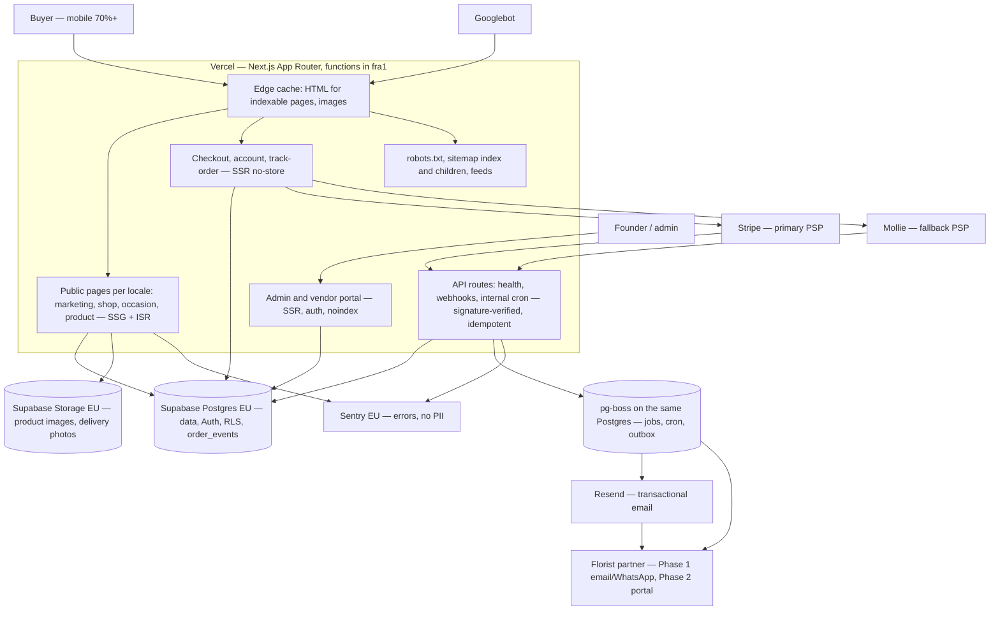

# Architecture

One deployable Next.js app, one Postgres, one object store, one queue. This document is the short,
current version of `plan/01-architecture.md`: the system as it is wired today, the module map with
its owning spec, and the decisions spec 001 deliberately deferred. The plan holds the reasoning,
the ADRs hold the decisions (`docs/adr/`), and this file holds what is true in the repository.

Spec 001 §2 "Documentation and ledger" owns this file; `plan/12` §9 makes it a deliverable of
**"spec 001, then any spec adding a module"**.

## 1. System overview

`plan/01` §1 as a diagram. Everything inside the Vercel box is this repository; everything outside
it is an actor or a processor. Nothing here is deployed twice: previews, staging and production are
the same code with different environment variables.



Rules that follow from the picture and are enforced elsewhere in the repo:

- every indexable page is server-rendered HTML at the edge (`plan/01` §3); personalisation is a
  client island, never a reason to SSR an indexable page;
- no IP-based redirect anywhere (ADR-0006, `fo/no-geo-redirect`); locale is in the URL, currency in
  a cookie;
- third-party SDKs live in one adapter per module; order status changes only through
  `orderService.transition` (ADR-0009, `fo/no-direct-order-status-write`);
- all environment access goes through `src/lib/env.ts`; all logging through `src/lib/logger.ts`.

## 2. Repository layout

The same tree `pnpm check-layout` enforces (`scripts/check-layout.ts`, spec 001 AC-3). The manifest
in that script is the machine-readable copy of this list; `tests/unit/architecture-doc.test.ts`
fails if the two disagree.

```
src/app/                  routes only, thin: a pass-through root layout plus one document per
                          leaf — (chooser)/ owns `/`, [locale]/ owns every localised URL,
                          not-found.tsx owns the 404 (see below) — plus api/
src/modules/<module>/     one directory per module below, public barrel in index.ts
src/lib/                  env (zod), logger, health, sentry, cache adapter; db client from spec 002
src/jobs/                 pg-boss job definitions and cron schedule
src/emails/               React Email templates, localised
src/config/               locales.ts, locales.data.ts, currencies.ts, address-formats.ts,
                          cookies.ts, countries.ts, site-links.ts, categories.ts, company.ts
                          (spec 003/004; zod-validated at module load, no database — `pnpm
                          check:no-db`. `locales.data.ts` is the authored locale rows as plain
                          constants and imports nothing, so the 500 document can read a locale
                          without pulling zod into every page's client chunk — TASK-046;
                          `cookies.ts` is the cookie register, and
                          `docs/compliance/cookie-register.md` derives its table from it via
                          `pnpm cookies:check` — TASK-050; countries.ts, site-links.ts,
                          categories.ts, company.ts are the Phase 0 data registries of spec 004
                          §2/§5.1 — TASK-047: the seven destinations with `toCountryRow()`, the
                          header/footer link registry behind `isPublished()`, the category row,
                          and the company identity behind `registered: false`);
                          occasions.ts follows in 004, and payment-methods-by-country.ts,
                          feature-flags.ts in 002/004
tests/unit/               Vitest, node env
tests/integration/        Vitest against DATABASE_URL (live from spec 002)
tests/contract/           adapter-against-recorded-fixture tests (from Phase 1)
tests/e2e/                Playwright, chromium mobile + desktop
tests/visual/             Playwright screenshots, 0.1% threshold
tests/fixtures/           shared fixtures: occasion dates, currencies, addresses, lint, seo, env
tests/a11y/, tests/dev-os/, tests/msw/   axe run, hook checks, request mocks
supabase/migrations/      versioned SQL, each with a documented rollback (from spec 002)
seed/                     idempotent seed scripts, keyed by natural keys
messages/                 next-intl catalogues + review manifests (spec 003)
content/i18n/             glossary and style guide per locale, the authority a native reviewer
                          reads (`plan/03` §6.6, spec 003); prose, never imported by code
scripts/                  repo tooling: check-layout, env-check, seo validators, dev-os checks
```

**Document shape (spec 003 §5.3, TASK-034).** `src/app/layout.tsx` is a **pass-through root**:
it renders no document — no `<html>`, no `<body>`, it returns its children — and carries the
`noindex,nofollow` metadata default so that every document below it inherits it, the 404 included
(spec 001 §6). The document itself is rendered by whichever leaf knows the language, which is why
no file in the repository contains a locale literal any more. There are four such documents (the
fourth exists only where `ENABLE_DEV_UI` is on):

- `src/app/(chooser)/layout.tsx` + `page.tsx` — the single non-localised URL, `/`, and since
  TASK-035 the crawlable locale chooser: one plain `<a>` per launch locale, labelled with its
  `nativeName` and carrying `lang`/`hreflang`, `noindex,follow` (the only `follow` document in
  Phase 0, `plan/02` §7), and no Client Component of any kind, so it needs no JavaScript. Its
  `<html lang dir>` come from the **x-default** locale in the registry (`plan/02` §3).
- `src/app/[locale]/layout.tsx` — every localised URL, with the `plan/01` §5 route groups
  (`(marketing)`, `(shop)`, `(checkout)`, `(account)`) created empty-but-real beneath it so specs
  004–011 add pages without touching routing. `<html lang dir>` come from the segment's `bcp47`
  and `dir` in the registry; `generateStaticParams` emits the launch locales only, and any other
  first segment (`/fr`, `/xx`, `/EN`, `/nope`) renders the 404 rather than a redirect (ADR-0006).
  The locale reaches next-intl through `setRequestLocale()`, never through a request header, so no
  response varies by header and none carries `Vary`.
- `src/app/not-found.tsx` — the 404 document, in the **x-default** locale from the registry
  (AC-8). Every 404 renders here: an unknown first segment and any unmatched path below a real
  locale alike, always status 404 and never a fabricated locale page.
- `src/app/(dev)/layout.tsx` + `(dev)/dev/components/page.tsx` — the component gallery (spec 004
  §2 "Component gallery", §13 Q10; TASK-045). A fourth document, in the x-default locale, present
  only when `ENABLE_DEV_UI=true`: it renders every token ramp and every component state, so one
  screenshot and one axe run cover states no Phase-0 page reaches (empty, error, disabled). It is
  `noindex`, it answers **404** when the flag is off, and the zod env schema fails the build when
  the flag is true while `VERCEL_ENV=production` — the pattern spec 003 established for
  `ENABLE_PSEUDO_LOCALES`. It is deliberately not Storybook: a second build, a second styling
  entry point and ~100 MB of devDependencies for a solo founder, in exchange for controls this
  project does not need.
- `src/app/global-error.tsx` — the last-resort 500 document (TASK-035, spec 003 §5.3), replacing
  Next's untranslated, `lang`-less built-in shell. It is an x-default document with `lang`, `dir`
  and a localised `<title>`, and it is what answers a failure at `/` now that the `(chooser)`
  group has no `error.tsx` of its own; every localised URL still has the nearer per-locale
  boundary of `src/app/[locale]/error.tsx`.

Every document has a non-empty localised `<title>` (WCAG 2.4.2): pages and `not-found.tsx` export
`generateMetadata`, the `[locale]` layout carries a segment default for the 500 boundary — a Client
Component cannot export metadata — and `global-error.tsx` renders the `<title>` element itself.
That is why `tests/a11y/shell.spec.ts` has no exception list any more.

**The `[locale]` layout's metadata default is the *error* title.** `generateMetadata` on the
segment returns `noindex,nofollow` plus `meta.error.title`/`.description`, and every page
overrides both halves with its own pair. That default is not a generic site title: the only
document that ever reaches it is the 500 boundary, because `error.tsx` is a Client Component and a
Client Component cannot export metadata — so the segment default is the *only* place a localised
`<title>` can come from on the failure path (AC-25, WCAG 2.4.2). A future page that forgets its own
`generateMetadata` will be titled as an error page, which is a visible bug rather than a silent
one, and that is the intended trade.

**`dynamicParams = false` is exported once, by `src/app/[locale]/layout.tsx`** — the central gate
TASK-035 moved up from the page, closing the carry-forward that TASK-034's review recorded. A
segment config option set on a layout governs the whole subtree, so every page below `[locale]`,
present and future, inherits the refusal and no author can forget it: a page added at `/de/about`
does not make `/fr/about` renderable. That matters because the layout deliberately resolves an
unknown segment to the x-default locale instead of throwing, so that a mis-routed request can
never produce a document with no language at all — without the routing-layer refusal, `/fr/about`
would render on demand in the x-default locale, a fabricated duplicate of the English URL that
spec 003 §6 forbids. Making the layout call `notFound()` instead was rejected for the reason
measured on Next 16.3.4 and recorded below: a `notFound()` from a matching route renders inside
the framework's own `<html id="__next_error__">` with no `lang`, whereas the routing-layer refusal
reaches `src/app/not-found.tsx` as a real x-default document.

**The rejected shape.** Spec 003 §5.3 recommends *two root layouts* — `(chooser)` and `[locale]`,
with no `src/app/layout.tsx` at all — and that arrangement was implemented and then measured on
Next 16.3.4: with two root layouts `src/app/not-found.tsx` is reached, but the framework wraps it
in a bare `<html>` of its own, so the effective document has nested `html`/`body` elements and no
`lang` attribute at all. AC-8's "a document whose `lang` is the x-default locale" and WCAG 3.1.1
Language of Page therefore both fail. (A nested `[locale]/not-found.tsx` is rendered when a
matching route calls `notFound()`, but inside the framework's `<html id="__next_error__">`, again
with no `lang`.) §5.3 anticipates this ("if Next 16 rejects that arrangement for the
unmatched-path 404") and the pass-through root above is its accepted alternative in the cheapest
form: one root, one document per leaf, no `headers()` read — which would opt every localised page
out of static rendering and defeat §5.4 — and no locale literal anywhere.

**Tripwire for spec 004: `dynamicParams` does not exist when Cache Components is enabled.** Next
16's `cacheComponents` (formerly `dynamicIO`) removes the `dynamicParams` segment option, and the
gate above is the routing layer's only refusal of an unknown locale segment. Whoever turns that
flag on has to replace it in the same PR — the layout deliberately resolves an unknown segment to
the x-default locale rather than throwing, so without a refusal at the routing layer `/fr/about`
would render on demand as a fabricated duplicate of the English URL (spec 003 §6).
`tests/e2e/locale-routing.spec.ts` is what fails if it is forgotten; do not "fix" that test.

`app/` imports from `modules/`, never the reverse. A module imports another module only through its
public `index.ts` — never a deep path. Both rules are ESLint errors
(`import/no-restricted-paths`, spec 001 AC-9).

**One measured exception, in one file: `src/app/global-error.tsx` imports a deep module path**
(`@/modules/i18n/error-document`) rather than the barrel. It is a Client Component attached to the
*root* error boundary, so everything it can reach is compiled into a client chunk that lands in
**every** document's initial script set, `/` included. The narrowing happened in three steps and
every number below is measured with a browser against `pnpm build && pnpm start`, summing Brotli
(quality 11) over every `.js` the page requests — lazily fetched chunks included, which is the
part `/review 26` had to add:

1. TASK-043 replaced the `@/modules/i18n` barrel with `messages.ts` + `registry.ts`. Through the
   barrel the chunk was the whole i18n module — formatters, collator, address formats, alternates
   builder, review gate, switcher — none of which a 500 page renders; that took 3.5 KB gzipped out
   of every document (`/review 23` raised it). It did **not** remove the 85.3 KB gz / 70.1 KB br of
   zod behind `messages.ts` → `schemas.ts` and `registry.ts` → `src/config/locales.ts`, which was
   the open item of spec 003 §14 A12.
2. TASK-046 took that zod out of the *initial* script set. `src/modules/i18n/error-document.ts`
   imports the x-default locale row from `src/config/locales.data.ts` (plain constants, no imports)
   and the four strings from `messages/en.json`, and nothing else, so the failure document reaches
   no schema, no provider and no message source — which is also the right shape for a document
   reached because something else already threw. `/` went from 190 706 B Brotli (226 575 gz) to
   **116 393 B (136 067 gz)**, and it is the whole 6 487 B under the 122 880 B budget it has.
3. The same PR, after `/review 26`, took it off the locale documents too. Step 2 left zod one hop
   away on a *lazy* chunk: `LocaleSuggestionBannerIsland.tsx` → `hints.ts` → `schemas.ts` → zod,
   and `src/app/[locale]/layout.tsx` renders that island unconditionally through
   `next/dynamic({ ssr: false })`, so every visitor of `/en`, `/de`, `/en-gb` and `/pl` fetched a
   70.8 KB Brotli validator immediately after hydration to decide an optional courtesy link.
   `hints.ts` now imports no validator at all — a regular expression and a launch-code list from
   `src/config/locales.data.ts` carry the two rules, `schemas.ts` is built from the same constants
   and stays the server-side boundary parser — and the island's chunk is 2 173 B. `/en` and `/de`
   went from 203 197 B Brotli (240 633 gz) to **129 638 B (150 992 gz)**, which is 6 758 B (5.5%)
   over the budget; that overage is `NextIntlClientProvider` and the framework floor, and it is
   the founder decision spec 004 §13 Q13 option (b) records (escalated, not loosened).

   Three tests keep the graph closed, because "nothing imports it" is a claim about a graph nobody
   can hold in their head: `tests/unit/error-document.test.ts` walks the imports of the 500
   document, `tests/unit/i18n-hints-zod-free.test.ts` walks them from the island and its loader
   (and proves the zod-free predicates and the schemas accept and reject the same values), and
   `scripts/client-js-budget.ts` asserts it from the build output over the document's scripts
   **and** the route's `next/dynamic` chunks — the manifest it ignored in step 2, which is why
   step 3 was needed at all.

The boundary rule that matters is preserved (`app/` → `modules/` is the permitted direction, and no
module reaches into another module's internals), and the barrel stays the import path for every
other file. A barrel export is a bundle liability in exactly this one position, which is worth
knowing before spec 004 adds a `ui` module with the same shape.

## 3. Modules

Responsibilities are `plan/01` §5 verbatim. "Owned by spec" is the same string as the module's
public barrel comment, and the test above compares them character by character: whoever changes one
changes the other. **When a spec adds a module it updates three places in the same PR: this table,
the `MODULES` manifest in `scripts/check-layout.ts`, and the new barrel's owning-spec comment.**

`plan/01` §5 names eleven modules and they are all domain-shaped; `ui` is the one addition, made by
spec 004 §2 / §13 Q9 (TASK-045), because a design system has no home among them and `app/` must
stay "routes only; thin" while the header and footer are rendered by every route group. It obeys
every rule the others do: one public barrel, no deep imports, `app/` imports from it and never the
reverse.

| Module | Responsibility (`plan/01` §5) | Owned by spec | Status |
|---|---|---|---|
| `catalog` | products, categories, occasions, pricing, translations | spec 005 | empty barrel |
| `geo` | countries, cities, postcodes, holidays, cutoffs, occasion calendar | spec 002 (data), spec 009 (cutoff/holiday logic) | empty barrel |
| `orders` | state machine, order service, assignment/routing rules | spec 015 (+ spec 016 routing) | empty barrel |
| `payments` | PaymentProvider interface; stripe/, mollie/ adapters; webhooks | spec 013 (+ spec 014 Mollie) | empty barrel |
| `partners` | fulfilment partners, coverage, payouts | spec 011 (application), spec 026/027 (portal) | empty barrel |
| `customers` | customers, recipients, consent | spec 019 | empty barrel |
| `notifications` | email + WhatsApp senders, templates, outbox consumer | spec 017 | empty barrel |
| `seo` | hreflang, canonical, JSON-LD builders, sitemap generators, robots | spec 007 | empty barrel |
| `i18n` | locale config, message loading, formatters, address formatting, the locale switcher | spec 003 | **complete for spec 003**: `registry`/`routing`/`messages`/`request` (four launch locales, authored path segments, fallback-chain merge, per-route namespace subsets), `format`/`collate`/`address` (all `Intl`; `fo/no-adhoc-intl` allows nowhere else), `schemas`, `review`/`alternates` (the 5 %-unreviewed indexability gate and the hreflang set), `pseudo` (`en-XA`/`ar-XB`), `hints`, `ui/LocaleSwitcher` and `ui/LocaleSuggestionBanner*`. Gated by `pnpm i18n:check`; no database (`pnpm check:no-db`) — the provider seam is what spec 002/012 hydrate |
| `analytics` | Consent Mode v2 + the gated GA4 tag; GA4 event schema, consent state, server-side events | spec 004 (loader), spec 023 (events) | `AnalyticsScripts` (the inline default-denied bootstrap and the env-gated tag) |
| `admin` | admin queries and actions | spec 012 | empty barrel |
| `ui` | design tokens, layout primitives, icons, chrome, the image wrapper | spec 004 | **tokens, fonts and primitives (TASK-045)**: the `@theme` token set and `@layer base` reset live in `src/app/globals.css`, the contrast manifest in `tokens/contrast.ts` (unit-tested against the tokens themselves), the two self-hosted families in `fonts/` (Newsreader 500 + IBM Plex Sans 400/600, 40 844 B total), the icon set and the brand `Mark` in `icons/`, and `Container`/`Stack`/`Row`/`Cluster`/`Grid`/`VisuallyHidden`/`SkipLink`/`Display`/`Text`/`Label`/`Button`/`Chip`/`Photo`/`Placeholder` in `primitives/` (no form control and no price block — spec 004 §3/§8 defer those to 010/013 and 005/008/009). Rendered in every state by `/dev/components`. Header, footer, trust strip, consent banner and `media/` arrive with TASK-048…TASK-053 |

Implemented outside the modules today (spec 001, all in `src/lib/`): `env` (+ `env.schema`,
`env.server`, `env.client`, `env.assert`), `logger`, `health`, `request-id` (the `x-request-id`
header name and its UUID v4 validation, shared by the proxy and `health`), `sentry`,
`robots-headers`, `cache` (the `invalidate` seam of `plan/01` §3, a noop until spec 007/008 wires
the Vercel adapter, plus the reserved `home:{locale}` tag name from TASK-034), and `src/proxy.ts` (request id only — the Next 16 `proxy` file convention,
renamed from `middleware.ts` in TASK-032).

Sentry is initialised from the repository root, and from **two** entrypoints rather than three:
`instrumentation.ts` loads `sentry.server.config.ts` (node) and `sentry.edge.config.ts` (edge).
There is no `instrumentation-client.ts` and no `sentry.client.config.ts` — see §4.

## 4. Deferred decisions recorded here

Spec 001 ships the gates, not the product, and it deliberately left three things undone; spec 003
removed two rows of its own from this table — the hard-coded English `lang` attribute (TASK-034) and
`middleware.ts` → `proxy.ts` (TASK-032) — and added one. Spec 004 removed the **CSP** row
(TASK-046). Each row is recorded here rather than in a comment nobody greps, with the spec that
lifts it. A later spec that touches one of these rows removes it.

**The CSP row is discharged, not deferred.** A `Content-Security-Policy-Report-Only` header is sent
on every path from `next.config.ts` (`src/lib/csp.ts`), together with `X-Content-Type-Options`,
`Referrer-Policy`, `X-Frame-Options`, `Permissions-Policy`, `Cross-Origin-Opener-Policy` and — in
production only — HSTS. `plan/01` §9's "CSP with nonces" sentence is **superseded, not edited**:
a nonce cannot exist in a cached SSG/ISR response without rendering every indexable page per
request, so cached routes get a static per-environment allowlist plus a build-time `'sha256-'` hash
for the one inline consent bootstrap, and the per-request nonce with `'strict-dynamic'` is reserved
for the `no-store` routes (checkout, account, admin, vendor) and belongs to the spec that ships the
first one. The decision, the alternatives and the accepted trade-off are
[ADR-0016](adr/ADR-0016-csp-allowlist-hash-on-cached-html.md). Two consequences recorded with it:
`https://vercel.live` — the platform's preview-feedback script — appears in the **preview** policy
only and is absent from production (spec 001's second deferred row, `/review 8`), and the enforce
flip is one env-store edit (`CSP_REPORT_ONLY=false`) once `/api/csp-report` has been quiet, not a
deploy.

| Decision | Deferred to | What lifts it |
|---|---|---|
| **`ALLOW_PLACEHOLDER_ENV`** — the escape hatch that lets `.env.example` placeholders pass validation in a deployed environment, set on Vercel preview and production so spec 001 can deploy without a database (`src/lib/env.schema.ts`, `docs/runbooks/vercel-setup.md`). | spec 002 | The first spec 002 task deletes the key from the schema, `.env.example`, the runbook and the Vercel env store once real Supabase values exist. Recorded as a carry-forward on `/review 7`. |
| **No browser Sentry SDK on public routes** — `instrumentation-client.ts` and `sentry.client.config.ts` were deleted (TASK-043). Server and edge Sentry, `sentryOptions()` and the `beforeSend` PII scrubber are untouched, and `NEXT_PUBLIC_SENTRY_DSN` stays in the schema because `next.config.ts` reads it to decide whether to run the source-map plugin. The cost is real: a JavaScript error on a marketing page is invisible until someone reports it. The reason is measured: the browser SDK plus the zod it dragged in was ~230 KB gzipped against a 120 KB budget — ~72 KB gzipped of the 297 KB `/` used to ship (spec 004 §13 Q8, accepted 2026-09-08; the full
measurement is spec 003 §14 A12). | spec 013 | The checkout spec re-adds a client SDK **scoped to the checkout routes**, where a client-side error costs money, and records the consent/PII position for browser events. `docs/compliance/ropa.md` row 1 is updated in the same PR. |
| **`deploymentEnvironment()` Railway caveat** — it reads `VERCEL_ENV`, so on the ADR-0012 Railway + Cloudflare fallback host every response would look like `development` and take the blanket `X-Robots-Tag: noindex` (spec 001 §2 "Hosting", review of PR #6). Harmless on Vercel, wrong the day the fallback is used. | spec 007 / ADR-0012 follow-up | Key the environment on a host-independent signal (an explicit `APP_ENV`) before or during the first production launch, and note it in the host-failover runbook. |

## 5. Where the rest lives

| Question | Document |
|---|---|
| Rendering, caching and invalidation per page type | `plan/01` §3, §4 |
| URL, canonical, hreflang and sitemap rules | `plan/02` |
| Locale set, message catalogues, formatting | `plan/03`, and `docs/runbooks/i18n-translations.md` for the procedure |
| Brand terms, tone, per-locale register | `content/i18n/glossary.en.md` and the per-locale files beside it |
| Cookies and client storage | `docs/compliance/cookie-register.md` |
| Data model, RLS, migrations | `plan/04`, then `supabase/migrations/` from spec 002 |
| Hosting, regions, protection, log drains | `plan/08`, `docs/runbooks/vercel-setup.md` |
| Compliance, RoPA, data residency | `plan/07`, `docs/compliance/` |
| Toolchain, CI gates, coverage policy | `plan/12`, `README.md` |
| Decisions and their history | `docs/adr/`, `docs/decisions-log.md` |
