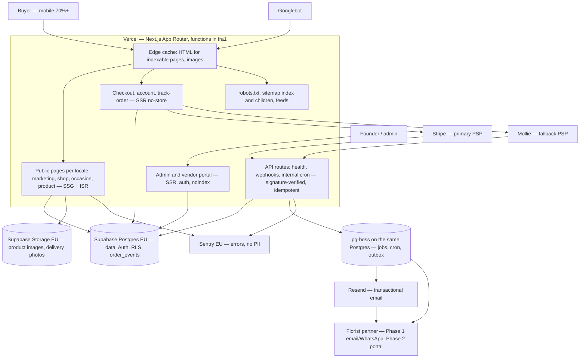

# Architecture

One deployable Next.js app, one Postgres, one object store, one queue. This document is the short,
current version of `plan/01-architecture.md`: the system as it is wired today, the module map with
its owning spec, and the decisions spec 001 deliberately deferred. The plan holds the reasoning,
the ADRs hold the decisions (`docs/adr/`), and this file holds what is true in the repository.

Spec 001 §2 "Documentation and ledger" owns this file; `plan/12` §9 makes it a deliverable of
**"spec 001, then any spec adding a module"**.

## 1. System overview

`plan/01` §1 as a diagram. Everything inside the Vercel box is this repository; everything outside
it is an actor or a processor. Nothing here is deployed twice: previews, staging and production are
the same code with different environment variables.



Rules that follow from the picture and are enforced elsewhere in the repo:

- every indexable page is server-rendered HTML at the edge (`plan/01` §3); personalisation is a
  client island, never a reason to SSR an indexable page;
- no IP-based redirect anywhere (ADR-0006, `fo/no-geo-redirect`); locale is in the URL, currency in
  a cookie;
- third-party SDKs live in one adapter per module; order status changes only through
  `orderService.transition` (ADR-0009, `fo/no-direct-order-status-write`);
- all environment access goes through `src/lib/env.ts`; all logging through `src/lib/logger.ts`.

## 2. Repository layout

The same tree `pnpm check-layout` enforces (`scripts/check-layout.ts`, spec 001 AC-3). The manifest
in that script is the machine-readable copy of this list; `tests/unit/architecture-doc.test.ts`
fails if the two disagree.

```
src/app/                  routes only, thin: [locale] segment, route groups, api/
src/modules/<module>/     one directory per module below, public barrel in index.ts
src/lib/                  env (zod), logger, health, sentry, cache adapter; db client from spec 002
src/jobs/                 pg-boss job definitions and cron schedule
src/emails/               React Email templates, localised
src/config/               locales.ts, currencies.ts, address-formats.ts (spec 003; zod-validated
                          at module load, no database — `pnpm check:no-db`); countries.ts,
                          payment-methods-by-country.ts, feature-flags.ts follow in 002/004
tests/unit/               Vitest, node env
tests/integration/        Vitest against DATABASE_URL (live from spec 002)
tests/contract/           adapter-against-recorded-fixture tests (from Phase 1)
tests/e2e/                Playwright, chromium mobile + desktop
tests/visual/             Playwright screenshots, 0.1% threshold
tests/fixtures/           shared fixtures: occasion dates, currencies, addresses, lint, seo, env
tests/a11y/, tests/dev-os/, tests/msw/   axe run, hook checks, request mocks
supabase/migrations/      versioned SQL, each with a documented rollback (from spec 002)
seed/                     idempotent seed scripts, keyed by natural keys
messages/                 next-intl catalogues (from spec 003)
scripts/                  repo tooling: check-layout, env-check, seo validators, dev-os checks
```

`app/` imports from `modules/`, never the reverse. A module imports another module only through its
public `index.ts` — never a deep path. Both rules are ESLint errors
(`import/no-restricted-paths`, spec 001 AC-9).

## 3. Modules

Responsibilities are `plan/01` §5 verbatim. "Owned by spec" is the same string as the module's
public barrel comment, and the test above compares them character by character: whoever changes one
changes the other. **When a spec adds a module it updates three places in the same PR: this table,
the `MODULES` manifest in `scripts/check-layout.ts`, and the new barrel's owning-spec comment.**

| Module | Responsibility (`plan/01` §5) | Owned by spec | Status |
|---|---|---|---|
| `catalog` | products, categories, occasions, pricing, translations | spec 005 | empty barrel |
| `geo` | countries, cities, postcodes, holidays, cutoffs, occasion calendar | spec 002 (data), spec 009 (cutoff/holiday logic) | empty barrel |
| `orders` | state machine, order service, assignment/routing rules | spec 015 (+ spec 016 routing) | empty barrel |
| `payments` | PaymentProvider interface; stripe/, mollie/ adapters; webhooks | spec 013 (+ spec 014 Mollie) | empty barrel |
| `partners` | fulfilment partners, coverage, payouts | spec 011 (application), spec 026/027 (portal) | empty barrel |
| `customers` | customers, recipients, consent | spec 019 | empty barrel |
| `notifications` | email + WhatsApp senders, templates, outbox consumer | spec 017 | empty barrel |
| `seo` | hreflang, canonical, JSON-LD builders, sitemap generators, robots | spec 007 | empty barrel |
| `i18n` | locale config, message loading, formatters | spec 003 | config landed, routing TASK-034 |
| `analytics` | GA4 event schema, consent state, server-side events | spec 023 | empty barrel |
| `admin` | admin queries and actions | spec 012 | empty barrel |

Implemented outside the modules today (spec 001, all in `src/lib/`): `env` (+ `env.schema`,
`env.server`, `env.client`, `env.assert`), `logger`, `health`, `request-id` (the `x-request-id`
header name and its UUID v4 validation, shared by the proxy and `health`), `sentry`,
`robots-headers`, `cache` (the `invalidate` seam of `plan/01` §3, a noop until spec 007/008 wires
the Vercel adapter), and `src/proxy.ts` (request id only — the Next 16 `proxy` file convention,
renamed from `middleware.ts` in TASK-032).

## 4. Deferred decisions recorded here

Spec 001 ships the gates, not the product, and it deliberately leaves four things undone. Each is
recorded here rather than in a comment nobody greps, with the spec that lifts it. A later spec that
touches one of these rows removes it.

| Decision | Deferred to | What lifts it |
|---|---|---|
| **CSP with nonces** — no `Content-Security-Policy` header is sent (spec 001 §8 "Security"). There is nothing to protect yet: the shell loads no script beyond the Next runtime and no third-party origin except Vercel's own preview-feedback script on protected previews. | spec 004 | The first design-system PR that adds a script or a font must add the header with nonces, and `plan/01` §9's report-only rollout. |
| **`<html lang="en">` literal** in `src/app/layout.tsx` — the one hard-coded locale in the repository (spec 001 §7, AC-30). The shell has no copy, so `fo/no-literal-strings` ships enabled with zero exceptions and this attribute is the only thing to remove. | spec 003 | next-intl lands and `lang` (and `dir`) come from the URL locale. The i18n implementer greps `lang="en"` and this row. |
| **`ALLOW_PLACEHOLDER_ENV`** — the escape hatch that lets `.env.example` placeholders pass validation in a deployed environment, set on Vercel preview and production so spec 001 can deploy without a database (`src/lib/env.schema.ts`, `docs/runbooks/vercel-setup.md`). | spec 002 | The first spec 002 task deletes the key from the schema, `.env.example`, the runbook and the Vercel env store once real Supabase values exist. Recorded as a carry-forward on `/review 7`. |
| **`deploymentEnvironment()` Railway caveat** — it reads `VERCEL_ENV`, so on the ADR-0012 Railway + Cloudflare fallback host every response would look like `development` and take the blanket `X-Robots-Tag: noindex` (spec 001 §2 "Hosting", review of PR #6). Harmless on Vercel, wrong the day the fallback is used. | spec 007 / ADR-0012 follow-up | Key the environment on a host-independent signal (an explicit `APP_ENV`) before or during the first production launch, and note it in the host-failover runbook. |

## 5. Where the rest lives

| Question | Document |
|---|---|
| Rendering, caching and invalidation per page type | `plan/01` §3, §4 |
| URL, canonical, hreflang and sitemap rules | `plan/02` |
| Locale set, message catalogues, formatting | `plan/03` |
| Data model, RLS, migrations | `plan/04`, then `supabase/migrations/` from spec 002 |
| Hosting, regions, protection, log drains | `plan/08`, `docs/runbooks/vercel-setup.md` |
| Compliance, RoPA, data residency | `plan/07`, `docs/compliance/` |
| Toolchain, CI gates, coverage policy | `plan/12`, `README.md` |
| Decisions and their history | `docs/adr/`, `docs/decisions-log.md` |
